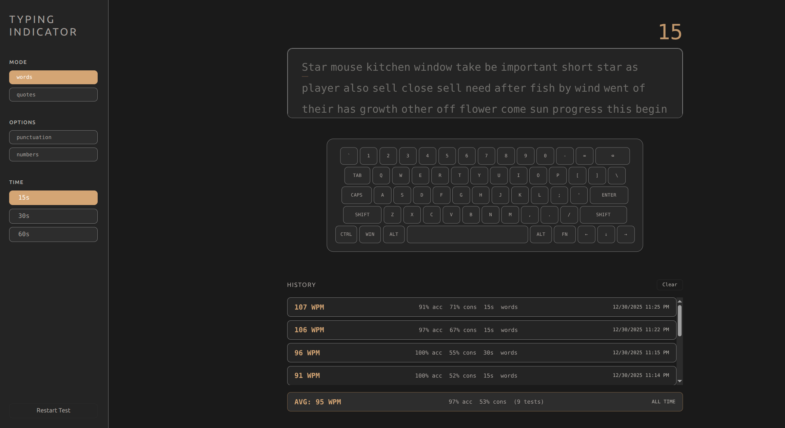

# Typing Indicator Keyboard

A minimalistic typing test with a reactive 62-key visual keyboard.

## Features

- 60% ANSI keyboard layout with glow-on-keypress effect
- Typing tests (15s, 30s, 60s)
- Metrics: WPM, Raw WPM, Accuracy, Consistency
- Modes: words, quotes
- Options: punctuation, numbers
- Local history tracking

## Usage

Open `index.html` in a browser.

## License

MIT
